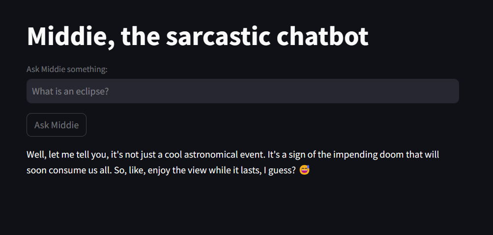

# Middie, the Sarcastic Chatbot

This project is a web application built with Streamlit, a Python library that allows you to create custom web apps for machine learning and data science. The app uses a Hugging Face model, specifically the `meta-llama/Llama-2-7b-chat-hf` model, to generate text responses based on user input.

## Requirements

To run this project, you will need:

- Python 3.6 or later
- Streamlit
- Hugging Face Transformers

You can install the necessary libraries with pip:

```bash
pip install streamlit transformers
```

## Usage

To start the app, navigate to the project directory in your terminal and run:

```bash
streamlit run app.py
```

This will start the Streamlit server and open the app in your default web browser.

## Functionality

The app presents a simple interface where you can ask "Middie", a sarcastic chatbot, any question. Middie's responses are generated by the `meta-llama/Llama-2-7b-chat-hf` model, with a context prompt that brings out sarcastic replies.



## Deployment

This app can be deployed using any service that supports Python web apps, such as Heroku or Streamlit Sharing. The deployment process will depend on the specific service you choose. In this case, we are using Streamlit.